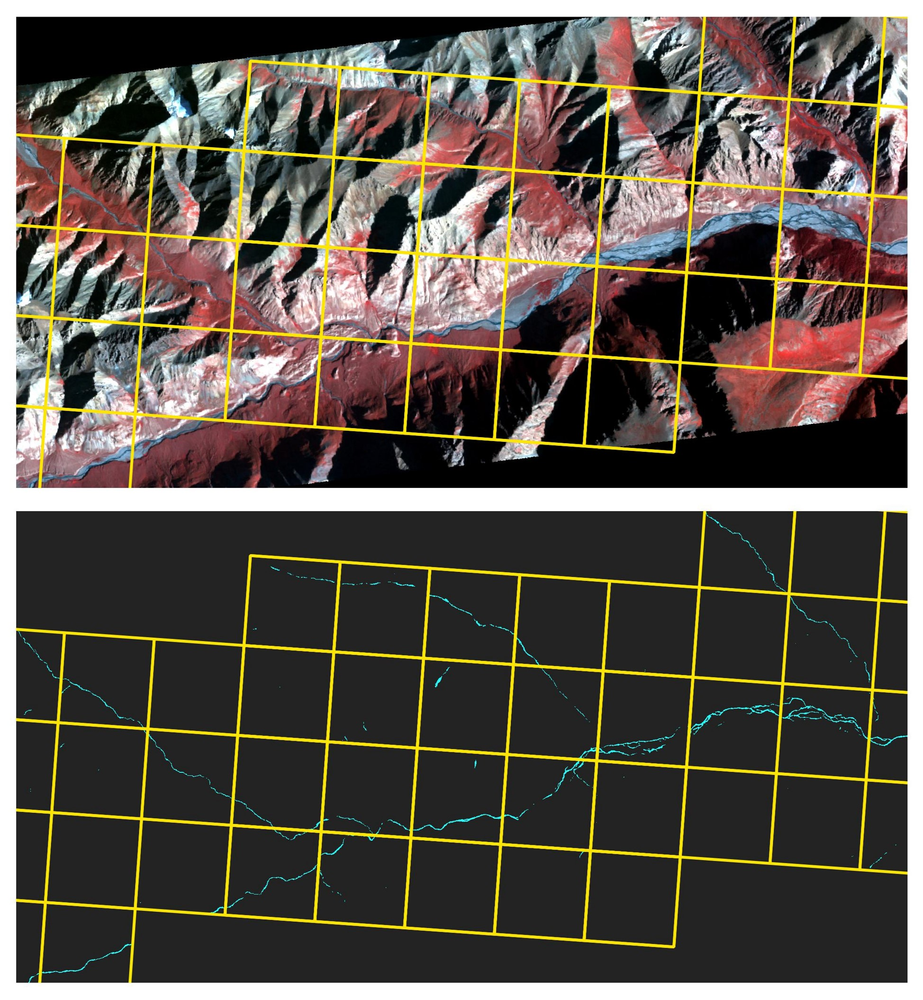

## Mapping proglacial in HMA with Planet imagery


The objective is to classify small proglacial stream in High Mountain Asia (HMA) using high-resolution Planet imagery. Raw images are preprocessed from 16-bit to 8-bit false color channels (nir,r,g,b) and are sliced into 512×512 chips before placing into the image segmentation/classification methods. Postprocessing of classified chips include merging of tiles to return the same geospatial information from the raw Planet imagery. 

### Prerequisites

Core modules:
* Tensorflow
* OpenCV
* GDAL
* Rasterio

Conda Environment:

Setup the conda environment using the *environment.yml* file. Note: This environment will include installation of core modules above and other modules might need to be updated.

```
conda env create -f environment.yml
```

### Implementation

Raw PlanetScope images should be preprocessed using *chips.py* (*/master/utils/*). 

Use the labeled chips generated from annotation tools such as [PixelAnnotationTool](https://github.com/abreheret/PixelAnnotationTool). The classification scripts calls the training and validation data following the structure below. Note: The *pred* folder is only used for full scene prediction tasks (see details in Full Scene Mapping section).

```
data
└───planet
│   └───imgs
│   │   │   chip1.tif
│   │   │   chip2.tif
│   │   │   ....
│   └───masks
│       │   chip1.png
│       │   chip2.png
│       │   ....
└───pred
    └───raw_planet
        │   raw_fullscene_SR1.tif
        │   raw_fullscene_SR2.tif
        │   ....

```

This repo also includes PlanetAPI image lookup, order, and downloads (under */master/planetAPI/*), PlanetScope raw image preprocessing, and water classifications implementations.

### Sample Results

Some illustration of mapping results between the classification methods from the PlanetScope scenes in HMA. To implement water classification methods, run:

```
    a) NDWI Thresholding (Simple and Otsu) - thresh.py
    b) Random forest - rf.py
    c) Computer Vision (U-Net) - cv.py
```


### Full scene multi-tile mapping within a PlanetScope strip in HMA using computer vision. 

For full classification of raw PlanetScope imagery, run *full_pred.py*. 

This will preprocess tha raw PlanetScope images inside the *pred/raw_planet* folder and identify water pixels using a pre-trained cv model for HMA (under *./log/cv_mul/cv_multi.hdf5*). See the referece below for more info about the cv model.

By default, this will create a *./pred_out* folder where it will write the water mask ouputs from the cv model.

```
data
└───pred
    └───raw_planet
        │   raw_fullscene_SR1.tif
        │   raw_fullscene_SR2.tif
        │   ....
pred_out
    │   raw_fullscene_SR1_mask.tif
    │   raw_fullscene_SR2_mask.tif
    │   ....

```




### Reference

To read more about this work or if you use this repository and find it helpful, please read/cite the article:

Flores, J. A., Gleason, C. J., Brinkerhoff, C. B., Harlan, M. E., Lummus, M. M., Stearns, L. A., & Feng, D. (2024). Mapping proglacial headwater streams in High Mountain Asia using PlanetScope imagery. *Remote Sensing of Environment, 306*, 114124. https://doi.org/10.1016/j.rse.2024.114124

If you have any questions or suggestions about this repo, please contact jflores@umass.edu.
